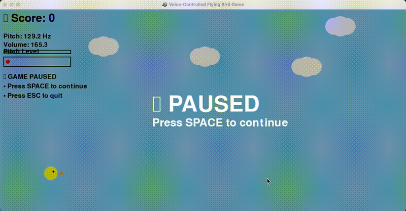

# � Interactive Programming Course - Assignment Collection

**Student**: WUYuying003  
**Course**: Interactive Programming  
**Institution**: The Hong Kong Polytechnic University  

## 🎮 Main Assignment: Voice-Controlled Flying Bird Game



*🎤 Watch the bird respond to voice commands in real-time! High pitch = fly up, Low pitch = fly down*

### 📁 Assignment Folder: `voice_controlled_bird_assignment/`

**Primary Project**: Advanced voice-controlled flying bird game demonstrating real-time audio processing and human-computer interaction.

#### 🎯 Key Academic Features:
- **Real-time Audio Processing**: FFT-based pitch detection
- **Game Development**: Professional Pygame implementation  
- **Multithreading**: Separate audio capture thread
- **Signal Processing**: Voice frequency analysis (80-1000Hz)
- **UI/UX Design**: Intuitive voice control interface

#### � Quick Demo:
```bash
cd voice_controlled_bird_assignment/
pip install -r requirements.txt
python voice_bird_game.py
```

**🎬 Interactive Demo**: The GIF above shows real voice control in action - notice the audio indicators responding to voice input!

---

## 🎯 Additional Projects Collection

### 🤖 AI Chatbot + Tetris Game
Secondary project showcasing AI integration with classic gaming


## 🚀 Quick Start

### For AI Chatbot + Tetris
```bash
# Clone the repository
git clone https://github.com/WUYuying003/interactive-projects.git
cd interactive-projects

# Install dependencies
pip install streamlit requests ollama pygame

# Start Ollama service
ollama serve
ollama pull llama3.2:1b

# Run integrated application
streamlit run week04/chatbot_with_tetris.py

# Or run standalone game
python tetris_game.py
```

### For Voice-Controlled Bird Game
```bash
# Navigate to voice game directory
cd voice_bird_game/

# Install dependencies
pip install pygame numpy pyaudio

# Run the game
python voice_bird_game.py
```

## ✨ Features

### 🎮 AI Chatbot + Tetris
- 🤖 AI Chat Assistant (supports game data analysis)
- 🎮 Complete Tetris game (with pause function)  
- 📊 Automatic game history recording
- 💬 Intelligent statistics queries
- 🎨 Responsive web interface

### 🎵 Voice-Controlled Bird Game
- 🎵 Real-time voice control using pitch detection
- 🎮 Smooth 60 FPS gameplay with Pygame
- 🎯 Obstacle avoidance with progressive difficulty
- ⏸️ Pause/resume functionality
- 📈 Real-time audio visualization
- 🏆 Scoring system with encouraging feedback

### 🎪 Mini Games Club Benefits
- 🔧 Multiple game engines (Web Canvas, Pygame)
- 🎨 Different interaction methods (AI chat, voice control)
- 📚 Educational code examples for game development
- 🚀 Easy setup and cross-platform compatibility

## 🎯 Instructions

### Tetris Game Controls
- `←→` Move | `↑` Rotate | `↓` Speed up | `Space` Hard drop | `P` Pause

### Voice Bird Game Controls
- **High Pitch**: Bird flies upward (try whistling or "eee" sounds)
- **Low Pitch**: Bird flies downward (try humming or "ooo" sounds)  
- **No Sound**: Bird maintains position
- **Space Bar**: Pause/Resume game
- **ESC Key**: Exit game

### AI Assistant
Ask about game performance: "How are my game records?"

## 📁 Project Structure

```
interactive-projects/                  # Mini Games Club Repository
├── week04/                           # AI Chatbot + Tetris
│   ├── chatbot_with_tetris.py        # Main integrated application
│   ├── simple_ollama_test_en.py      # Simple chatbot (English)
│   ├── ollama_chatbot.py             # Basic chatbot
│   └── requirements.txt              # Dependencies
├── voice_bird_game/                  # Voice-Controlled Bird Game
│   ├── voice_bird_game.py            # Main voice game (advanced)
│   ├── simple_voice_bird.py          # Simplified version
│   ├── requirements.txt              # Audio dependencies
│   └── README.md                     # Detailed game documentation
├── tetris_game.py                    # Standalone Tetris game (Pygame)
├── requirements.txt                  # Main dependencies
└── README.md                         # Club overview and documentation
```

## 🛠️ Technical Stack

### AI Chatbot + Tetris
- **Frontend**: Streamlit + HTML5 Canvas
- **Backend**: Python
- **AI Model**: Ollama (llama3.2:1b)
- **Game Engine**: HTML5 Canvas (web) + Pygame (standalone)
- **Data Storage**: Browser LocalStorage

### Voice-Controlled Bird Game
- **Game Engine**: Pygame for graphics and input handling
- **Audio Processing**: PyAudio for real-time audio capture
- **Signal Analysis**: NumPy FFT for pitch detection
- **Threading**: Separate audio thread for smooth performance
- **Audio Range**: 80-1000 Hz (human voice range)

## 🎨 Key Features

### 🤖 AI Chatbot + Tetris
1. **Dual-column layout**: Chat on left, game on right, no interference
2. **Smart data analysis**: AI understands and analyzes your game performance
3. **Pause function**: Supports pausing and resuming game anytime
4. **History records**: Automatically saves and queryable game history
5. **Responsive design**: Adapts to different screen sizes

### 🎵 Voice-Controlled Bird Game
1. **Advanced Audio Processing**: Real-time FFT-based pitch detection
2. **Smooth Voice Control**: Responsive bird movement based on voice pitch
3. **Visual Feedback**: Real-time audio level and pitch indicators
4. **Balanced Difficulty**: Optimized obstacle spacing for voice control
5. **Professional UI**: Pause overlay, game over screen, scoring system
6. **Dual Versions**: Advanced pitch-based and simple volume-based control

### 🎪 Mini Games Club Philosophy
1. **Innovation**: Exploring new interaction methods (voice, AI chat)
2. **Education**: Well-documented code for learning game development
3. **Accessibility**: Multiple difficulty levels and control options
4. **Community**: Open source for collaboration and improvement
5. **Cross-platform**: Works on Windows, macOS, and Linux

## 🎤 Voice Game Setup Requirements

- **macOS**: `brew install portaudio`
- **Ubuntu/Debian**: `sudo apt-get install portaudio19-dev`  
- **Windows**: Usually works with standard pip installation
- **Microphone**: Any working microphone (built-in or external)
- **Quiet Environment**: Recommended for best voice control experience

---

## 🎮 Welcome to the Mini Games Club!

Join our interactive gaming community where we explore innovative control methods and create engaging experiences. Whether you're interested in AI integration, voice control, or classic game mechanics, there's something here for every game enthusiast!

**Repository**: https://github.com/WUYuying003/interactive-projects  
**Author**: WUYuying003  
**Contact**: 25056092g@connect.polyu.hk

### 🚀 Coming Soon
- Gesture-controlled games using computer vision
- Multiplayer online mini-games
- VR/AR interactive experiences
- More AI-powered game assistants

**Happy Gaming! 🎊**
